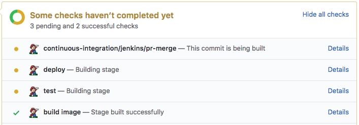

# Job And Stage Monitoring Plugin

This is a job monitoring plugin, which watches for pipeline builds and sends job and stage level stats to various endpoints, including

- GitHub (to see pending/success/error status from your PR)
- InfluxDB (for building monitoring dashboards).
- StatsD (alternative monitoring metrics)

Since it watches for changes from all pipeline jobs, it doesn't require modifying your Jenkinsfiles - once installed, 
it automatically provides stats for all pipeline jobs ran on the Jenkins master.

## GitHub status

The plugin can be configured to send commit status for each stage for jobs build from a multibranch project. For example:

## Grafana dashboards

The plugin can also be configured to send job and stage stats to an InfluxDB instance, which can be used to build dashboards in Grafana to monitor build time and success rate. For example:

For more information, please visit [the plugin's page on jenkins.io](https://plugins.jenkins.io/github-autostatus).
