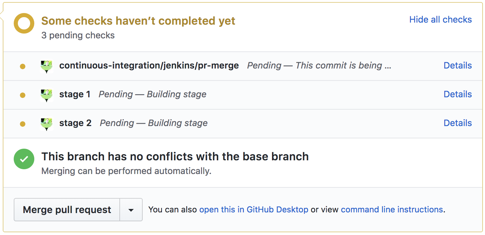
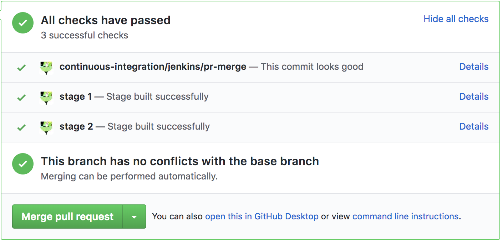
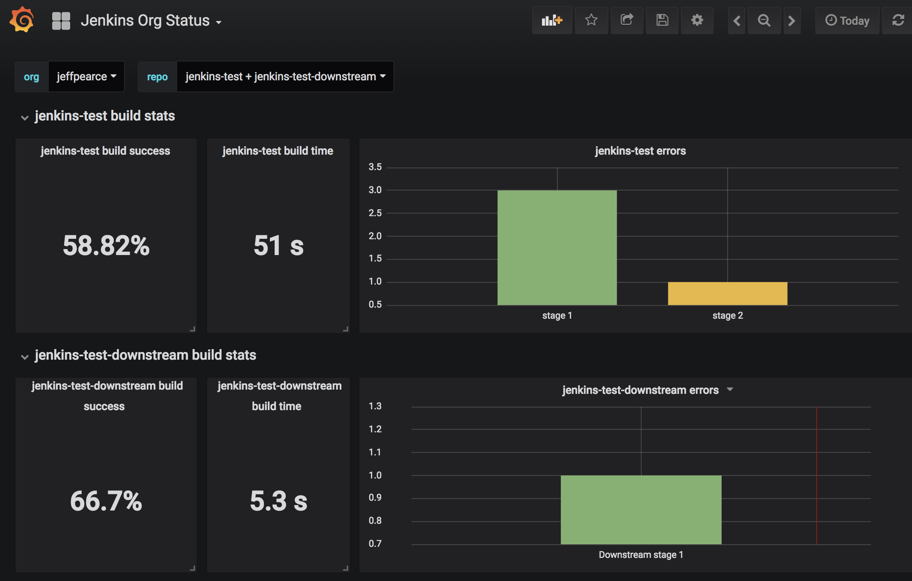
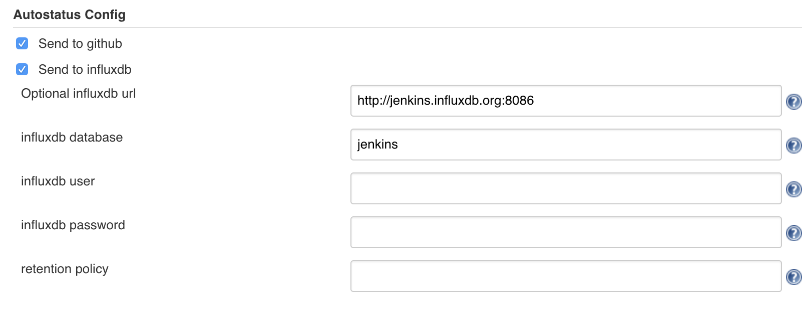
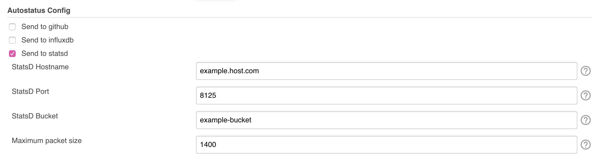

# Job And Stage Monitoring Plugin

This is a job monitoring plugin, which watches for pipeline builds and automatically sends job and stage level stats to various endpoints, including:

- GitHub (to see pending/success/error status from your PR)
- InfluxDB (for building monitoring dashboards).
- StatsD (alternative monitoring metrics)

For example:

    pipeline {

      agent any

      stages {

        stage('Stage 1') {

          ...

        }

        stage('Stage 2') {

          ...

        }

    }

    }

Since it watches for changes from all pipeline jobs, it doesn't require modifying your Jenkinsfiles - once installed, it automatically provides stats for all pipeline jobs ran on the Jenkins controller.

## Note: breaking change in version 3.0

Version 3.0 is listed as a breaking change in the Jenkins plugin update center. This is because the optional user/password for notifying InfluxDB now uses the credentials store instead of separate strings.

This is more secure, because otherwise the credentials are stored in plain text on the Jenkins controller.

If you are using the InfluxDB feature (and using user/password), you will need to reconfigure the plugin to get them from a Jenkins credential after upgrading. If this does not apply to you, you don't need to do anything after upgrading.

## GitHub status
The plugin can be configured to send commit status for each stage for jobs built from a multibranch project. The GitHub page for the commit will initially show pending for each stage:

As each step is completed, the status will change to completed or error, depending on the outcome of the stage. At the end of a successful build,
the PR page will show the following:

## Grafana dashboards

The plugin can also be configured to send job and stage stats to an InfluxDB instance, which can be used to build dashboards in Grafana to monitor build time and success rate. For example:

You can use the provided sample dashboards as-is, or as a starting point for you own dashboards. The sample dashboard shows overall build pass rate, average build time, and error counts for each stage.

The dashboard can be configured to show all jobs, or you can select the jobs you want to show.

### Configuring the plugin to send stats to Grafana

By default, the plugin only provides status to Github. To enable reporting stats to InfluxDB for the Grafana dashboards:

1.  Open the system settings page in Jenkins (Manage Jenkins \> Configure System)
2.  Find the **Autostatus Config** section
3.  Click the **Send to influxdb** option
4.  Enter information for InfluxDB installation. You must provide the InfluxDB URL and database - all other information is
    optional.
    

### Importing the sample dashboard

A sample dashboard is available from Grafana.com. The sample dashboard provides a dropdown for all of the orgs with stats, and a second dropdown for all of the repos within an org.

To import the sample dashboard (instructions current as of Grafana 5.0):

1.  Log into your Grafana installation with a login that has permissions to create dashboards.
2.  Click the dashboard dropdown in the upper left of the page.
3.  Click the **Import dashboard** link.
4.  Enter the id **5786** in the **Grafana.com Dashboard** field.
5.  Click the **Load** button.
6.  Select the InfluxDB source that matches the database configured in Jenkins.
7.  Click **Import**.

Once you've imported the dashboard, just select the org you want to monitor, then select the repos you want to provide stats for.

The sample dashboard is just a starting point to demonstrate how the InfluxDB stats can be used to build dashboards. You can create dashboards that show more detailed information, such as graphs of build health over time. I'll continue to publish additional samples to Grafana.com as time permits.

## Configuring the plugin to send stats to StatsD

As noted above, by default the plugin only provides status to Github. To enable reporting metrics to StatsD (introduced in 3.5.0):

1.  Open the system settings page in Jenkins (Manage Jenkins \> Configure System)
2.  Find the **Autostatus Config** section
3.  Click the **Send to statsd** option
4.  Enter the relevant information for your StatsD collector. You can provide:
    1.  StatsD Hostname
    2.  StatsD Port
    3.  StatsD Bucket
    4.  Maximum packet size (optional, defaults to 1400)

